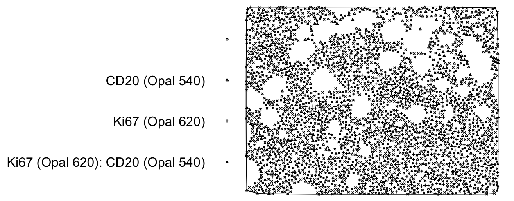
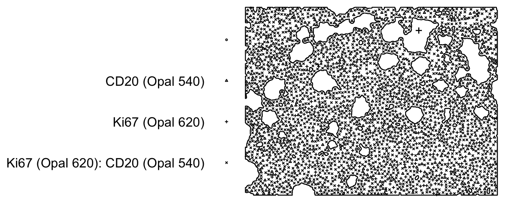

# PatternExtract ‒ Spatial Point Pattern Pipeline
**PatternExtract** is an automated cross-platform pipeline for transforming whole-slide images (WSI) or tissue microarrays (TMA) into spatial point pattern (`ppp`) objects.
It integrates `OpenCV`, `QuPath`, and `R’s spatstat` framework to streamline quantitative spatial analysis of histology markers.
This workflow presents an example for Ki67 histology marker.

## Workflow
#### 1. Pre-process images in Python (`OpenCV`)
Overlay cell centroids from CSVs onto tissue images to generate masks, preserving tissue contours and holes where cells are absent.

**Example**

RGB image:


Mask annotation:


#### 2. Generate GeoJSONs in QuPath (`Groovy` script)
Run pixel classification and object segmentation in QuPath to generate GeoJSON annotations of tissue regions, filling holes and preserving region structure.

#### 3. Construct `ppp` objects in R (`spatstat`)
Convert the exported spatial coordinates into analyzable point pattern datasets.

**Example**

Below are examples of the resulting point patterns when using a convex-hull window (approximate tissue boundary) versus a precise GeoJSON annotation (true tissue contour).

Convex-hull window (approximate tissue boundary)


Precise GeoJSON annotation (true tissue contour)


See `Full_program_run_Ki67.ipynb` for a complete, runnable example of the full pipeline.

## Requirements
* Python ≥ 3.9 — install with `pip install -r requirements.txt`
* R ≥ 4.2 with `spatstat`
* QuPath ≥ 0.6.0

## Quick start
```bash
git clone https://github.com/shrutisridhar99/PatternExtract.git

# create a new conda environment
conda create -n patternextract python=3.9 -y
conda activate patternextract

# install dependencies
pip install -r requirements.txt
conda install jupyter -y  # optional: to run the notebook

# execute the pipeline notebook
jupyter nbconvert --to notebook --execute Full_program_run_Ki67.ipynb
```

After updating the file paths on line 40 of `createproject_ki67.groovy` and line 29 of `R_script_ki67.R` to match the correct folders on your machine, you can run the cells in the Jupyter notebook.

## Initially required project structure
```bash
PatternExtract/
│
├── LICENSE
├── requirements.txt
├── README.md
│
├── scripts/
│   ├── createproject_ki67.groovy        # QuPath Groovy script for project creation
│   ├── Full_program_run_Ki67.ipynb      # Main Python notebook to run the pipeline
│   ├── annotate_ki67_cells.ipynb        # Script for the detection and annotation of Ki67+ cells
│   ├── R_script_ki67                    # Script for the conversion to spatial point patterns 
│
├── data/
│   ├── CSV/                             # Cell detection outputs (x–y centroids, phenotypes)
│   │   └── NSB__NUH_A2_1_HP_IM3_0_Core[1,1,1,1]_[26506,6132]_component_data_res1.csv
│   │
│   └── Images_RGB/                       # Input RGB images
│       └── NSB__NUH_B2_1_HP_IM3_0_Core[1,3,8,1]_[41694,8530]_component_data_res1.jpg
```

## License
MIT © 2025
